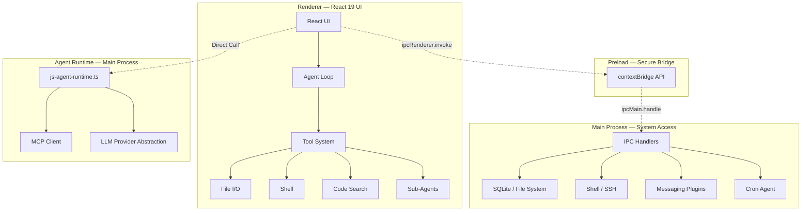

<p align="center">
  <a href="https://github.com/AIDotNet/OpenCowork">
    
  </a>
  <h1 align="center">OpenCowork</h1>
  <p align="center">
    <strong>Open-source desktop platform for multi-agent AI collaboration</strong><br>
    Empowering AI agents with local tools, parallel teamwork, and seamless workplace integration.
  </p>
</p>

<!-- 📸 PROJECT BANNER / SCREENSHOT PLACEHOLDER -->
<p align="center">
  
  <br>
</p>

<p align="center">
  <a href="README.zh.md">中文文档</a> •
  <a href="#why-opencowork">Why OpenCowork</a> •
  <a href="#key-features">Features</a> •
  <a href="#architecture">Architecture</a> •
  <a href="#quick-start">Quick Start</a>
</p>

<p align="center">
  
  
  
  
  
</p>

---

## 🚀 Why OpenCowork?

Traditional LLM interfaces are often "environment-isolated islands." Developers spend 50% of their time copy-pasting code, terminal logs, and file contents between the chat and their IDE.

**OpenCowork solves this by providing:**

- **Local Agency** — Agents can directly read/write files and execute shell commands with your permission.
- **Context Awareness** — No more manual context feeding. Agents explore your codebase and logs autonomously.
- **Task Orchestration** — Complex tasks ("Refactor this module and update tests") are broken down and handled by specialized sub-agents.
- **Human-in-the-loop** — You stay in control with a transparent tool-call approval system.

## 💡 Inspiration

OpenCowork is deeply inspired by **Claude CoWork**. We believe the future of productivity lies in a "Co-Working" relationship where humans provide direction and AI handles the iterative execution, tool manipulation, and cross-platform communication.

## ✨ Key Features

### ⚙️ Core Runtime

- **4-layer Electron architecture** — Main process, Preload bridge, Renderer UI, and Agent runtime running in main process.
- **Provider-agnostic** — Works with any LLM provider; bring your own model.
- **TypeScript throughout** — End-to-end type safety from database to UI.

### 🔄 5 Session Modes

Every conversation chooses the right mode for the task:

- `chat` — Conversational Q&A, no tool access.
- `clarify` — Ask questions to refine vague requirements before execution.
- `cowork` — Full agent mode: code search, file I/O, shell, and sub-agent delegation.
- `code` — Focused code generation and editing with Monaco Editor integration.
- `acp` — Autonomous coding pipeline: plan, implement, review autonomously.

### 🧰 Native Toolbox & Rich Skills

- **Built-in tools** — File I/O, Shell (bash/powershell), Code Search (glob/grep), Web Scraping, OCR, Excel/Word/PDF processing.
- **Extensible Skills** — Load domain-specific capabilities via Markdown-defined skills:
  - **1RPA** — Supplier invoice upload for SRM systems.
  - **CSV Pipeline** — Filter, join, aggregate, and transform tabular data.
  - **Document Suite** — Create & edit DOCX, XLSX, PDF with tracked changes and formatting.
  - **Web Scraper** — Extract structured content from live pages.
  - **Image OCR** — Read text from screenshots and scanned documents.
  - **Email Drafter** — Compose professional correspondence from templates.
  - **WeChat UI Sender** — Send messages via desktop WeChat automation.

### 💬 8 Workplace Messaging Plugins

Bridge your local agents to any messaging platform:

| Platform                  | Support |
| ------------------------- | ------- |
| Feishu / Lark             | ✅      |
| DingTalk                  | ✅      |
| Discord                   | ✅      |
| QQ                        | ✅      |
| Telegram                  | ✅      |
| WeCom (WeChat Work)       | ✅      |
| Weixin (Official Account) | ✅      |
| WhatsApp                  | ✅      |

### ⏰ Persistence & Cron Agent

- **SQLite persistence** — Messages, sessions, projects, tasks, and plans survive restarts.
- **Cron scheduling** — Schedule agents for daily reports, log monitoring, or any recurring task.
- **Multi-channel delivery** — Results can be delivered via desktop notification or any messaging plugin.

## 🛠️ Quick Start

### Prerequisites

- Node.js >= 18
- npm >= 9

```bash
git clone https://github.com/AIDotNet/OpenCowork.git
cd OpenCowork
npm install
npm run dev
```

### Key Commands

| Command             | Description                           |
| ------------------- | ------------------------------------- |
| `npm run dev`       | Start Electron + Vite with hot reload |
| `npm run build`     | Typecheck then build for production   |
| `npm run build:win` | Build Windows installer               |
| `npm run lint`      | ESLint with cache                     |
| `npm run typecheck` | TypeScript check (main + renderer)    |
| `npm run format`    | Prettier auto-format                  |

> **Data directory:** `~/.open-cowork/` — contains SQLite database (`data.db`), config, agents, commands, and prompts.

## 🏗️ Architecture

OpenCowork follows a **4-layer Electron architecture** for security and performance.



- **Renderer** — React 19 UI, agent loop, and tool system.
- **Preload** — Secure `contextBridge` with a narrow API surface.
- **Main Process** — IPC handlers, SQLite, filesystem, shell, SSH, plugins.
- **Agent Runtime** — Provider-agnostic runtime (`js-agent-runtime.ts`) with MCP client support.

## 🌟 Use Cases

- **Autonomous Coding** — Let agents refactor code, fix bugs, and write tests directly in your workspace.
- **Automated Ops** — Schedule agents to monitor logs or system status and report to Feishu/Slack.
- **Data Research** — Agents can scrape web data, process local CSVs, and generate visual reports.

## 🔗 Ecosystem Pairing

### Codex-Manager

- Repository: [qxcnm/Codex-Manager](https://github.com/qxcnm/Codex-Manager)
- Recommended pairing: use Codex-Manager as the management or orchestration entry point for Codex-centric workflows, while OpenCowork handles local file operations, multi-agent execution, workplace messaging, and desktop automation.
- Best for: teams that want to separate task management and workflow organization from local execution and office integration.
- A simple way to think about it: **Codex-Manager organizes the work, OpenCowork executes it in the real workspace.**

## 📈 Star History

[](https://star-history.com/#AIDotNet/OpenCowork&Date)

## 🤝 Contributing

We welcome contributions! Please see our [Development Guide](docs/development.md) for more details.

#### Special thanks

<div>
    <div align="left">
      <h1>RoutinAI</h1>
       
    </div>
[RoutinAI](https://routin.ai/) is an enterprise-grade unified LLM API gateway that provides a single, type-safe interface to access over 100 leading large language models from the GPT, Claude, and Gemini families, including models such as gpt-5.4, claude-opus-4-6, and gemini-3.1-pro-preview. It eliminates the complexity of managing multiple AI vendors by providing zero-latency edge routing, seamless model switching without code modifications, unified billing, and centralized governance with spending caps and access policies.
</div>

## 💝 Sponsors

- [lchlfe@hotmail.com](mailto:lchlfe@hotmail.com)
- [caomaohanfengZT](https://github.com/caomaohanfengZT)
- [struggle3](https://github.com/struggle3)

<div>
    <div align="left">
      <h1>GeneralUpdate</h1>
       
    </div>
[GeneralUpdate](https://github.com/GeneralLibrary/GeneralUpdate) is a cross-platform application auto-upgrade component based on .NET Standard 2.0, released under the Apache 2.0 license. It provides a comprehensive upgrade solution supporting full updates, incremental binary differential updates, and in-place updates across Windows, macOS, and Linux — completely independent of any UI framework. Trusted by dozens of enterprises worldwide, GeneralUpdate eliminates the complexity of building and maintaining custom upgrade pipelines, enabling developers to integrate automatic upgrade capabilities into their applications with a single click.
</div>

## 📜 License

Licensed under the [Apache License 2.0](LICENSE).

---

<div align="center">

If this project helps you, please give it a star. ⭐

Made with ❤️ by the **AIDotNet** Team

</div>
