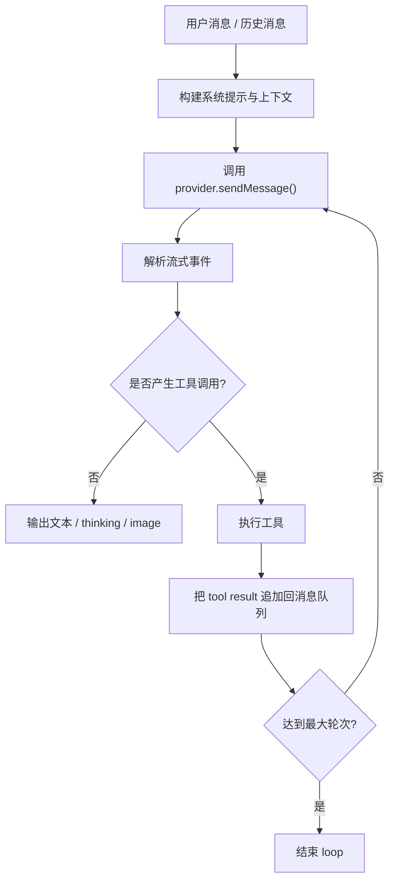

# Agent 循环 / Agent Loop

Agent Loop 是 OpenCowork 的核心执行引擎，入口位于 `src/renderer/src/lib/agent/agent-loop.ts`。它是一个 `AsyncGenerator`：每轮都会把消息发给 provider、解析流式事件、执行工具、再把工具结果追加回消息队列。

## 工作流程 / Flow



## 核心入口 / Core entry

```ts
runAgentLoop(messages, config, toolCtx, onApprovalNeeded?)
```

### 关键参数

| 参数 | 作用 |
| --- | --- |
| `messages` | 当前对话消息 |
| `config.provider` | 当前 provider 配置 |
| `config.tools` | 已注册工具定义 |
| `config.contextCompression` | 上下文压缩配置 |
| `config.maxIterations` | 最大循环轮次 |
| `config.signal` | AbortSignal，用于取消请求 |
| `toolCtx` | 工具执行上下文（IPC、工作目录、会话、插件信息） |

## 流式事件 / Streaming events

Agent Loop 会把流式事件持续抛给 UI，常见事件包括：

- `loop_start`
- `iteration_start`
- `thinking_delta`
- `text_delta`
- `tool_use_streaming_start`
- `tool_use_args_delta`
- `tool_call_start`
- `tool_call_approval_needed`
- `tool_call_result`
- `context_compression_start`
- `context_compressed`
- `message_end`
- `error`
- `loop_end`

这些事件最终驱动聊天窗口、右侧面板、审批弹窗和运行统计。

## 运行时细节 / Runtime details

### 1) Provider 重试

Provider 请求会进行有限次数重试。网络抖动、429、短暂连接问题会自动重试；认证错误通常不会重试。

### 2) 并行工具调用

Agent Loop 会限制并行工具数，避免一次性把太多任务同时推向本地或远端工具。

### 3) 上下文管理

在每轮迭代之间，Loop 会检查上下文是否接近阈值：

- 先做轻量 pre-compress
- 再做完整压缩
- 压缩后继续循环

### 4) 审批流

对于危险操作，Loop 会把 `tool_call_approval_needed` 发给 UI，等待用户确认后再继续。

### 5) Thinking / image / provider 元数据

Loop 不只处理纯文本，还会处理：

- `thinking_delta` / `thinking_encrypted`
- `image_generated` / `image_error`
- provider response id
- request debug 信息

## 主进程复用 / Main-process reuse

渲染进程的 Agent Loop 和主进程 JS Agent Runtime 共享同一套事件协议和工具语义。区别只是：

- 渲染进程负责前台交互
- 主进程负责后台任务、Cron、插件自动回复

## 为什么它重要 / Why it matters

如果你想理解 OpenCowork 的本质，先看 Agent Loop：

- 它决定模型怎么被调用
- 它决定工具怎么串起来
- 它决定 UI 为什么可以实时显示思考、工具和结果
- 它也是自动化是否可靠的核心
