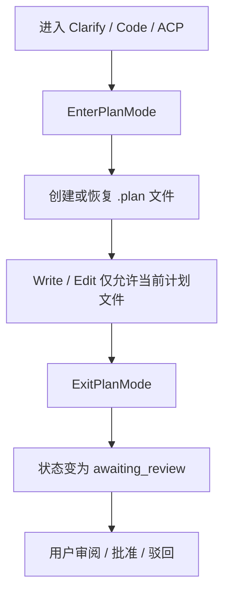

# 计划模式 / Plan Mode

Plan Mode 是 OpenCowork 用来处理复杂任务的“先规划、后执行”流程。它的核心不是 UI 开关，而是两个工具：`EnterPlanMode` 和 `ExitPlanMode`。

## Plan Mode 的目标 / Goal

- 把模糊需求拆成清晰步骤
- 让计划文件可审阅
- 在真正修改代码前先锁定方案
- 避免一边做一边改方向

## 工作流程 / Flow



## 关键文件 / Key files

| 位置 | 作用 |
| --- | --- |
| `src/renderer/src/lib/tools/plan-tool.ts` | `EnterPlanMode` / `ExitPlanMode` 工具实现 |
| `src/renderer/src/stores/plan-store.ts` | 计划状态和本地缓存 |
| `src/main/db/database.ts` | `plans` 表和计划持久化 |

## 计划文件放在哪里？ / Where is the plan file?

当一个会话进入 Plan Mode 时，系统会在当前 working folder 下创建：

```text
.plan/<plan-id>.md
```

也就是说，计划文件和项目代码在同一个上下文里，方便审阅和后续执行。

## 状态流转 / Status flow

`PlanStore` 里可见的状态有：

| 状态 | 含义 |
| --- | --- |
| `drafting` | 正在写计划 |
| `awaiting_review` | 计划已完成，等待用户审阅 |
| `approved` | 用户已批准 |
| `implementing` | 正在执行实现 |
| `completed` | 计划执行完成 |
| `rejected` | 用户驳回 |

## 工具行为 / Tool behavior

### EnterPlanMode

- 需要活跃 session
- 需要 working folder
- 如果已有草稿计划，可以恢复
- 如果没有计划，会创建新的 plan 记录和计划文件
- 进入后，当前会话会切换到 Plan Mode 状态

### ExitPlanMode

- 会先读取当前 plan 文件
- 计划文件不能为空
- 退出时会把 plan 设为 `awaiting_review`
- 返回 plan 内容，等待用户批准

## 计划模式下允许的工具 / Allowed tools

Plan Mode 不是“完全禁用工具”，而是**限制工具边界**：

- `Read`
- `LS`
- `Glob`
- `Grep`
- `Write`
- `Edit`
- `EnterPlanMode`
- `ExitPlanMode`
- `AskUserQuestion`
- `TaskCreate` / `TaskGet` / `TaskUpdate` / `TaskList`
- `Task`
- `get_goal` / `create_goal` / `update_goal`
- `visualize_show_widget`

其中 `Write` / `Edit` 只能作用于当前 plan 文件。

## ACP 和 Plan Mode 的区别 / ACP vs Plan Mode

- **Plan Mode**：允许写计划文件，面向“执行前审阅”
- **ACP**：不直接改代码，面向“架构控制和委派”

## 实际建议 / Practical advice

- 小任务可以直接 Code
- 不清楚需求时先 Clarify，再 Plan Mode
- 复杂功能、多人协作功能、风险较高的改动，优先 Plan Mode
- 写完计划后，不要急着执行，先让用户看一眼
