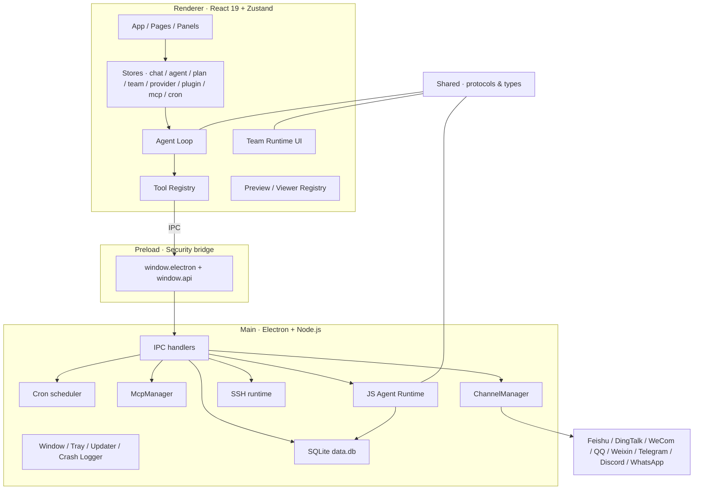

# 整体架构概述 / Architecture Overview

OpenCowork 的实现可以概括为一句话：**Electron 主进程负责系统能力，渲染进程负责 Agent 运行时和 UI，Preload 只暴露最小桥接，Shared 维护跨进程契约。**

## 架构图 / Architecture diagram

## 四层职责 / Four layers

### 1) Main

入口是 `src/main/index.ts`。主进程负责：

- 创建窗口、托盘和更新器
- 注册所有 IPC handlers
- 管理 SQLite 数据库
- 管理 Cron、SSH、MCP 和消息平台插件
- 处理崩溃日志和系统级错误
- 在启动和退出时统一清理后台资源

### 2) Preload

入口是 `src/preload/index.ts`。它只暴露少量能力：

- image 下载 / base64 / 剪贴板
- Team Runtime 创建、快照、消息、成员更新
- Team Worker 的启动与停止

这层是安全边界，不承载业务逻辑。

### 3) Renderer

入口是 `src/renderer/src/main.tsx`。它承担：

- React UI
- Agent Loop
- Tool Registry
- Provider 适配
- 计划 / 任务 / 团队 / 资源面板
- 文件预览与浏览器面板
- 应用插件工具注册

### 4) Shared

`src/shared/` 集中放：

- Agent stream / loop 协议
- Team Runtime 类型
- OpenAI / Anthropic 消息协议
- 迁移类型与其他跨进程 DTO

## 关键运行时 / Key runtime components

| 组件 | 作用 | 位置 |
| --- | --- | --- |
| `ChannelManager` | 管理 8 个消息平台插件 | `src/main/channels/` |
| `McpManager` | 管理 MCP server 连接和能力发现 | `src/main/mcp/` |
| `CronScheduler` | 处理 at / every / cron 调度 | `src/main/cron/` |
| `JS Agent Runtime` | 供 Cron 和插件自动回复复用的主进程 Agent 运行时 | `src/main/ipc/js-agent-runtime.ts` |
| `Tool Registry` | 统一注册与调用工具 | `src/renderer/src/lib/agent/tool-registry.ts` |
| `viewerRegistry` | 注册文件预览器 | `src/renderer/src/lib/preview/` |

## 数据流 / Data flow

1. 用户在 UI 中发起聊天、计划、任务或插件动作。
2. React store 更新本地运行态。
3. Agent Loop 通过 provider 发起模型请求并接收流式事件。
4. 工具调用被分发到 renderer、本地 store、主进程 IPC、MCP、Team Runtime 或插件服务。
5. 主进程负责落盘、系统调用、消息平台交互和后台调度。
6. 结果回流到 store，再驱动 UI、右侧面板、通知窗口或外部消息平台。

## 设计原则 / Design principles

- **本地优先**：默认不依赖外部托管状态。
- **边界清晰**：系统能力不直接暴露给 renderer。
- **协议先行**：跨进程和跨 runtime 的对象优先定义在 `shared/`。
- **可插拔**：provider、channel、MCP、skill、command、agent 都是注册式扩展。
- **可追溯**：任务、计划、Cron、Goal 和 usage 都能在本地查询。
